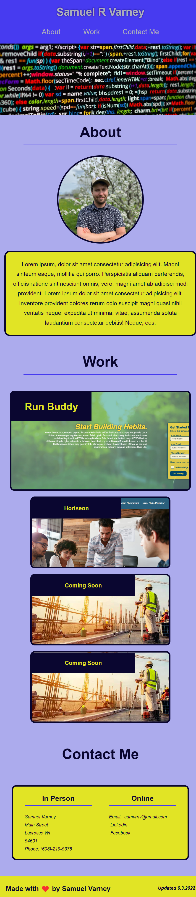

# Samuel Varneys Professional Portfolio

## Purpose
A professional portfoili is very important to a developer, or really any working professional who wants to demonstrate their skillset to a potential employer. That said, this is my first portfolio as a web developer, and though the color scheme is going to eventually need an update, this is a sampling of the work I've done so far!

## Built With
* HTML
* CSS

## Website
https://samvrny.github.io/Samuel-Varney-Coding-Portfolio/

Here is a look at the finished webpage!

## Contribution
Made by Samuel Varney

